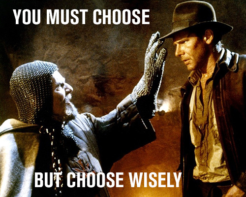

# CivicSource Development Interview

There are two tests in this repo designed to get a quick grasp of your dev abilities. [Create a `solution` branch](https://help.github.com/articles/creating-and-deleting-branches-within-your-repository/) in this repo and [submit a pull request](https://help.github.com/articles/using-pull-requests/) when you are done.

Each test has a list of tasks to complete. If you don't get through all of it or if you feel like it is taking too long, it's not a big deal. Just explain what you did, what you didn't get to, any problems you faced, and any other relevant information in your [pull request](https://help.github.com/articles/using-pull-requests/).

There is an [HTML 5 / JS test](html5) & a [C# test](csharp). Choose which one you would like to do.

